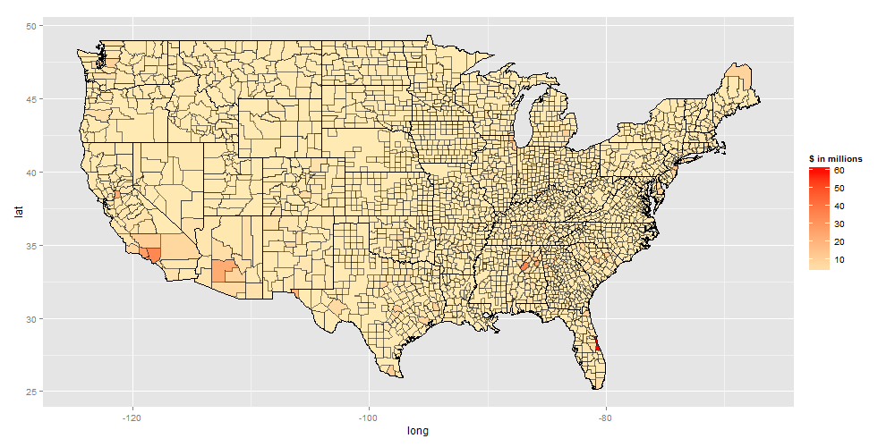
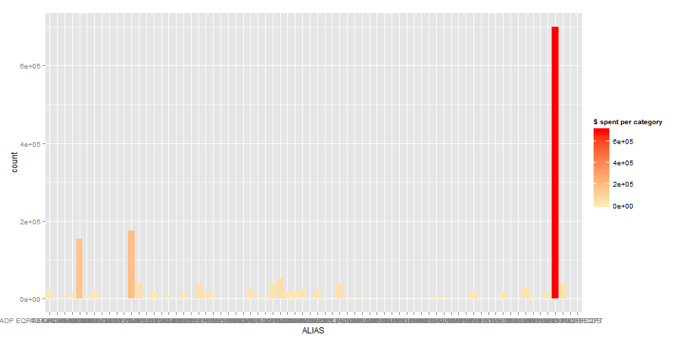
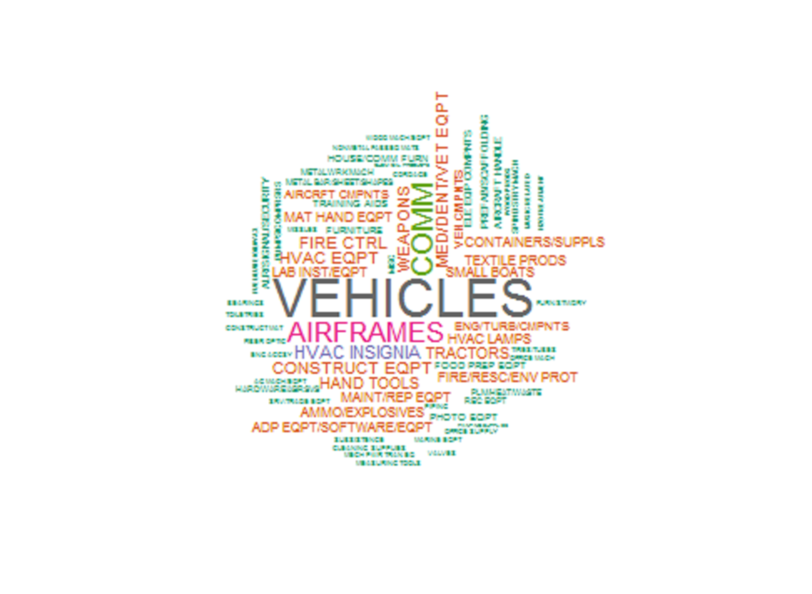

1033 DoD Acquisition Data
============

###RStudio config:
```{r}
sessionInfo()
```

SQL Query:
```
  merged <- dbGetQuery(jdbcConnection, "select * from inventory, transactions where transactions.nsn = inventory.nsn and transactions.\"State\" <> 'PR' and transactions.\"State\" <> 'VI' and transactions.\"State\" <> 'DC' and transactions.\"State\" <> 'GU'")
  
```

Building the Map Data
```
states=map_data("state")
county=map_data("county")
```

Color Legend Setup
```  
low <- rgb(255,234,180,255,maxColorValue=255)
high <- "red"
countylines <- rgb(30,30,30,150,maxColorValue=255)
```

1033 State Spending Histogram
===
Plotting and Building Data Frame for Reuse
```
h <- ggplot(data=merged) 
h <- h + geom_histogram(aes(x=State, fill=..count.., weight=Quantity*Acquisition_Cost/1000000))
h + scale_fill_gradient("$ in millions", low = low, high = high)
hg <- ggplot_build(h)

sdata <- as.data.frame(hg$data[1])
```


Abbreviate State Data
```
states$region <- gsub("(^|[[:space:]])([[:alpha:]])", "\\1\\U\\2", states$region, perl=TRUE)
states$abb <- state.abb[match(states$region,state.name)]
sdata$abb <- state.abb[order(state.abb)]

```

Merge and Sort State Data
```
comb <- merge(states,sdata,by="abb")

attach(comb)
scomb <- comb[order(order),]
detach(comb)
```

1033 State Heat Map
====
Plotting
```
t<- ggplot()
t<-t+geom_polygon(data=scomb,aes(x=long,y=lat,group=group.x,fill=count),size=0.5,color="black")
t + scale_fill_gradient("$ in millions", low = low, high = high)
```


Build a Histogram Weighted Data Frame by County and Sort
```
merged$CST <- paste(merged$County,merged$State,sep=", ")
h2 <- ggplot(data=merged) 
h2 <- h2 + geom_histogram(aes(x=CST, fill=..count.., weight=Quantity*Acquisition_Cost/1000000))
h2 + scale_fill_gradient("$ in millions", low = low, high = high)
hg2 <- ggplot_build(h2)

cdata <- as.data.frame(hg2$data[1])

countyList <- merged
attach(countyList)
counties <- countyList[order(CST),]
detach(countyList)
counties <- unique(counties$CST)
cdata$CST <- counties

county$subregion <- toupper(county$subregion)

county$region <- gsub("(^|[[:space:]])([[:alpha:]])", "\\1\\U\\2", county$region, perl=TRUE)

county$region <- state.abb[match(county$region,state.name)]

county$CST <- paste(county$subregion,county$region,sep=", ")

comb <- merge(county,cdata,by="CST")

attach(comb)
scomb <- comb[order(order),]
detach(comb)
```

1033 County Heat Map
====
Plotting
```
t2<- ggplot()
t2 <-t2 +geom_polygon(data=states,aes(x=long,y=lat,group=group),fill=low)
t2<-t2+geom_polygon(data=scomb,aes(x=long,y=lat,group=group.x,fill=count),color=countylines)
t2 <-t2 +geom_polygon(data=states,aes(x=long,y=lat,group=group),size=0.5,fill=rgb(0,0,0,0),color="black")
t2 + scale_fill_gradient("$ in millions", low = low, high = high) 
```


Top 10 Counties in Dollars Spent
```
topcounties <- subset(scomb,select=c(CST,subregion,region,count))
attach(topcounties)
tmp <- topcounties[order(-count),]
detach(topcounties)
topcounties <- tmp
top10counties <- head(unique(topcounties),10)
```

1033 Top 10 Spending Counties
====
Plotting
```
t10 <- ggplot(data=top10counties) 
t10 <- t10 + geom_histogram(aes(x=CST, fill=..count.., weight=count))
t10 + scale_fill_gradient("$ in millions", low = low, high = high)
```


Numbers by Equipment Category
```
catData <- subset(merged,select=c(FEDERAL_SUPPLY_CATEGORY_NAME,Quantity,Acquisition_Cost))

attach(catData);
cats <- catData[order(FEDERAL_SUPPLY_CATEGORY_NAME),]
detach(catData);
cats <- unique(cats$FEDERAL_SUPPLY_CATEGORY_NAME);
```

1033 Equipment Category Spending
====
Plotting
```
hcd <- ggplot(data=catData)
hcd <- hcd + geom_histogram(aes(x=FEDERAL_SUPPLY_CATEGORY_NAME, fill=..count..,weight=Quantity*Acquisition_Cost))
hcd + scale_fill_gradient("$ spent per category", low = low, high = high)
catDataW <- as.data.frame(ggplot_build(hcd)$data[1])
catDataW$FEDERAL_SUPPLY_CATEGORY_NAME <- cats
```


1033 Equipment Word Map
====
Plotting
```
catDataW$freq <- as.integer(catDataW$count)

pal2=brewer.pal(8,"Dark2")

wordcloud(catDataW$FEDERAL_SUPPLY_CATEGORY_NAME, catDataW$freq,scale=c(40,0.5), max.words=300, 
          random.order=FALSE,random.color=TRUE, rot.per=0.35, colors=pal2)
```
